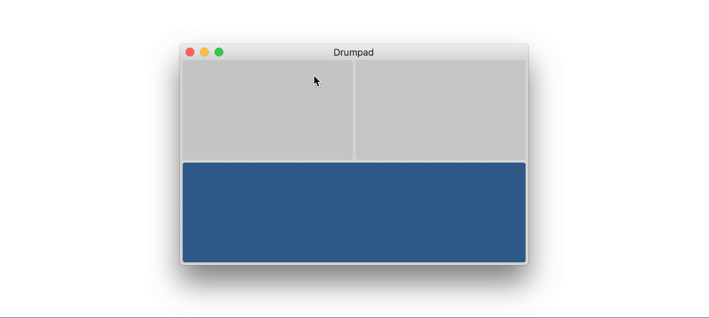

Use your trackpad as drumpad.

## Installation
Download the [latest release](https://github.com/Dev1an/Trackpad-Drummer/releases/latest).

## Compatibility

Supported trackpads:
- Any macbook's trackpad
- Magic trackpad 2

## Technical
- Written completely in Swift.
- Under 100 lines of code

### Where to start
- User interface: [Main.storyboard](Magic%20Drumpad/Base.lproj/Main.storyboard)
- Application logic: [Viewcontroller.swift](Magic%20Drumpad/ViewController.swift)
- Audio player: [ConcurrentPlayer.swift](Magic%20Drumpad/ConcurrentPlayer.swift)
