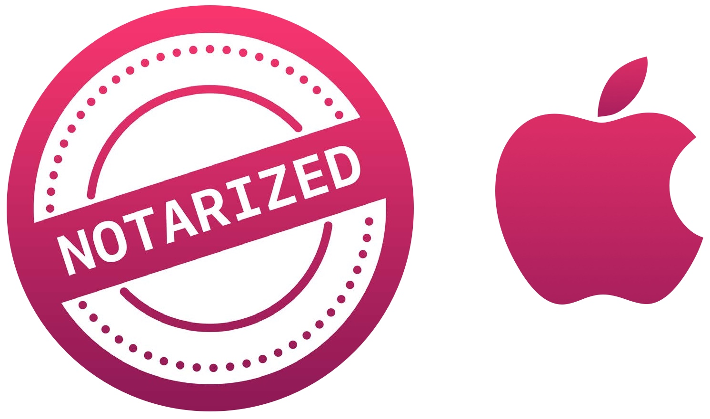

Use your trackpad as (MIDI) drumpad.

## Installation
Download the [latest release](https://github.com/Dev1an/Trackpad-Drummer/releases/latest). If you like the project, click on the star button on the top right of this page.

## Compatibility

Tested trackpads:
- [x] MacBook Pro 15" Late 2013 (internal trackpad)
- [x] Magic trackpad 2

## Features
- Written completely in Swift.
- Outputs to speakers or to a MIDI device. 
- Themed to support macOS Mojave Dark mode
- 

### Where to start ... for developers
- User interface: [Main.storyboard](Magic%20Drumpad/Base.lproj/Main.storyboard)
- Application logic: [PadController.swift](Magic%20Drumpad/PadController.swift)
- Audio player: [Player.swift](Magic%20Drumpad/Player.swift)
